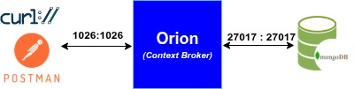
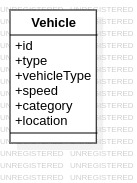

# Operaciones CRUD con NGSI-v2
Este ejercicio tiene como objetivo practicar las operaciones CRUD (Crear, Leer, Actualizar, Borrar) utilizando la API NGSI-v2 de FIWARE. El alumno podrá utilizar cualquier software cliente HTTP, como Postman, curl, o cualquier otro de su elección.

#### ¿Qué ha de entregar el alumno?
Independientemente del software cliente HTTP utilizado, el alumno deberá entregar uno de los dos siguientes documentos:

 - Un fichero con los comandos curl utilizados para cada una de las secciones del ejercicio. El script deberá tener la siguiente estructura:
   ```bash
   ###
   # Número de la sección del ejercicio
   ###
   <comando curl>
   ```
- Un fichero de texto con extensión `.http` con el formato utilizado por la extensión REST Client de Visual Studio Code. El fichero deberá tener la siguiente estructura:
   ```
   ###
   # Número de la sección del ejercicio
   ###
   <comando HTTP>
   ```

## Requisitos previos
Para poder realizar el ejercicio es necesario poner en marcha un Orion Context Broker de Fiware en local. Para ello, es necesario tener instalado

- [Docker](https://docs.docker.com/get-docker/) y [Docker Compose](https://docs.docker.com/compose/install/).

- Una herramienta para realizar peticiones HTTP, como [Postman](https://www.postman.com/) o [cURL](https://curl.se/). O el uso del [complemento REST Client](https://marketplace.visualstudio.com/items?itemName=humao.rest-client) de [Visual Studio Code](https://code.visualstudio.com/).

### Despliegue de Orion Context Broker con Docker
Para desplegar un Orion Context Broker de Fiware en local, se clonará el siguiente repositorio de GitHub:

```bash
git clone https://github.com/franciscodelicado/Fiware-CRUD-exercises.git
cd Fiware-CRUD-exercises
git checkout crud
```
A continuación, se ejecutará el siguiente comando para iniciar el broker:

```bash
./service start
```
Con ello tendremos desplegada una arquitectura básica de Fiware como la que se muestra en la [Figura 1](#fig:architecture)).
<a name="fig:architecture" ><figure>  
  
  <figcaption align="center" size="tiny">Figura 2: Arquitectura de trabajo.</figcaption>
</figure></a> 

## ¿Qué hay que hacer?
El ejercicio versa sobre el realizar operaciones en Fiware sobre entidades de tipo `Vehicle` tal y como se describe en [Smart Data Model](https://github.com/smart-data-models/dataModel.Transportation/blob/master/Vehicle/doc/spec.md)[^1]. Un posible esquema de la entidad básica `Vehicle` puede verse en la [Figura 2](#fig:vehicle)).
<a name="fig:vehicle" ><figure>  
  
  <figcaption align="center" size="tiny">Figura 2: Entidad Vehicle.</figcaption>
</figure></a>   

Una vez desplegado Orion, se realizarán las siguientes operaciones:
### C.1 Crear entidades de tipo `Vehicle`
Se deberán crear dos entidades de tipo `Vehicle`:
  - Uno debe ser una bicicleta de un servicio público
  - Otro debe ser un coche particular

Se recomienda usar la especificación de [Smart Data Models](https://smart-data-models.github.io/dataModel.Transportation/Vehicle/doc/spec.md) para definir los atributos de las entidades. Y especificar las unidades de cada atributo, si fuera el caso, con el metadato `unitCode` siguiendo la [norma UN/CEFACT Common Code](https://unece.org/sites/default/files/2021-06/rec20_Rev17e-2021_0.xlsx)[^2].

También se recomienda usar como `id` una URI del tipo NGSI para evitar duplicidades.

### U.1 Actualizar localización de un vehículo
Se actualizará la localización de la bicicleta a "C/Menéndez Pidal, 3. Albacete" (busca la longitud y latitud de dicho punto en Google Maps). 

### U.2 Añade un nuevo atributo al coche
Añade un nuevo atributo al coche llamado `fuelType` con el valor `diesel`. Y otro llamado `gear` que indica la marcha del coche, los valores pueden ser (1, 2, 3, 4, 5,..., N, R); inicialmente el   valor será N.

### U.3 Actualiza el coche
Actualiza los atributos del coche para indicar que va en 4 a 90 km/h por la carretera N-430 Km 138.

### D.1 Borrar atributo
Borra el atributo `speed` de la bicicleta.


[^1]: Smart Data Models. "Entidad: Vehículo". [https://github.com/smart-data-models/dataModel.Transportation/blob/master/Vehicle/doc/spec.md](https://github.com/smart-data-models/dataModel.Transportation/blob/master/Vehicle/doc/spec.md). Acceso 1/10/2025
[^2]: UNECE. "UNECE Recommendation N°20 - Codes for Units of Measure Used in International Trade". [https://unece.org/sites/default/files/2021-06/rec20_Rev17e-2021_0.xlsx](https://unece.org/sites/default/files/2021-06/rec20_Rev17e-2021_0.xlsx). Acceso 1/10/2025